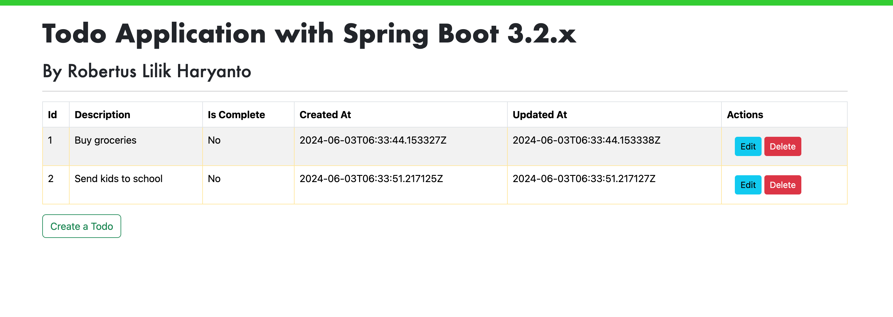

# Todo Application with Spring Boot 3.2.x



This is an ENTIRE application for Java Spring Boot built using:
- Spring Boot 3.2.x
- Spring Data JPA
- H2 Database (embedded) / PostgreSQL
- Thymeleaf

## Development instructions

- Clone the source code from Git repository
  ```
  git clone https://github.com/secangkirkopipanas/todo-application.git
  ```
  
- Change directory to the application directory
  ```
  cd todo-application
  ```

- Build the application
  ```
  ./mvnw clean package
  ```
  
- Run the application
  ```
  mvnw spring-boot:run
  ```
  
- Open the application from Internet broser with this URL:
  ```
  http://localhost:8080
  ```

## Environment Variables

### Common variables
| **Enviroment variables**     | **Description**                     | **Default value**                                                                                                      |
|------------------------------|-------------------------------------|------------------------------------------------------------------------------------------------------------------------|
| APP_PORT                     | Application port                    | 8080                                                                                                                   |
| SPRING_ACTIVE_PROFILES       | Active profiles                     | dev                                                                                                                    |
| MANAGEMENT_BASE_URL          | Management base URL                 | /management                                                                                                            |

### Profile-specific variables
| **Enviroment variables**     | **Description**                     | **Default value**                                                                                                                                                                |
|------------------------------|-------------------------------------|----------------------------------------------------------------------------------------------------------------------------------------------------------------------------------|
| DATASOURCE_DRIVER_CLASSNAME  | Driver classname of the datasource  | **[dev]** org.h2.Driver <br/> **[sit]** org.postgresql.Driver <br/> **[prod]** org.postgresql.Driver                                                                             | 
| DATASOURCE_URL               | URL of the datasource               | **[dev]** jdbc:h2:mem:todo <br/> **[sit]** jdbc:postgresql://todo-java-db-svc:5432/todo-java-sit-db <br/> **[prod]** jdbc:postgresql://todo-java-db-svc:5432/todo-java-prod-db   |
| DATASOURCE_USERNAME          | Username of the datasource          | **[dev]** admin <br/> **[sit]** <empty> <br/> **[prod]** <empty>                                                                                                                 |
| DATASOURCE_PASSWORD          | Password of the datasource          | **[dev]** password <br/> **[sit]** <empty> <br/> **[prod]** <empty>                                                                                                              |
| JPA_DIALECT                  | JPA dialect                         | **[dev]** org.hibernate.dialect.H2Dialect <br/> **[sit]** org.hibernate.dialect.PostgreSQLDialect <br/> **[prod]** org.hibernate.dialect.PostgreSQLDialect                       |
| H2_CONSOLE_ENABLED           | H2 console flag                     | **[dev]** true <br/> **[sit]** false <br/> **[prod]** false                                                                                                                      |

## Original project

This is the foked project of https://github.com/wazooinc/spring-boot-3-todo-application with some improvements.